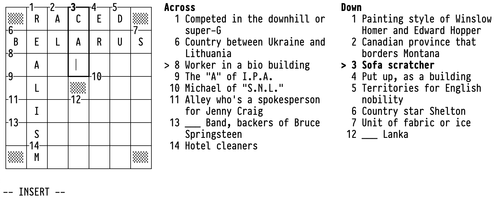

# xword-vim

xword-vim is a terminal interface for solving crossword puzzles with
Vim-like keybindings.

It is a work in progress.

## Keybindings

Like in Vim, you start in *normal mode*, where you can use the following
keys to navigate through the puzzle (these should feel pretty intuitive
if you already use Vim):

- `h` `j` `k` `l`: move left (`h`), down (`j`), up (`k`), or right
  (`l`), skipping over black squares.
- `gg` `G` `0` `$`: jump to the topmost (`gg`), bottommost (`G`),
  leftmost (`0`), or rightmost (`$`) square – if the cursor is in the
  across direction. If it’s in the down direction, the behaviours of
  `gg` `G` and `0` `$` are swapped.
- `w` `b` `e` `ge`: jump to the next word (`w`), previous word (`b`),
  next end of word (`e`), or previous end of word (`ge`) (“word” meaning
  “run of white squares”). The across words and down words are linked,
  such that if you’re at the last across word and press `w`, you jump to
  the first down word, etc.
- `r<letter>`: replace the current letter with the specified letter.
- `x`: delete the current letter.
- `<Space>`: toggle the direction of the cursor.
- `:q<Enter>`: [quit](https://www.youtube.com/watch?v=TLbfqZBL8t8).

To actually type letters into the puzzle, press `i` to enter *insert
mode*. The cursor turns into an I-beam, and you can type as normal,
using `<Backspace>` to delete mistakes. To leave insert mode and go back
to normal mode, press `<Esc>` or `jk`.
